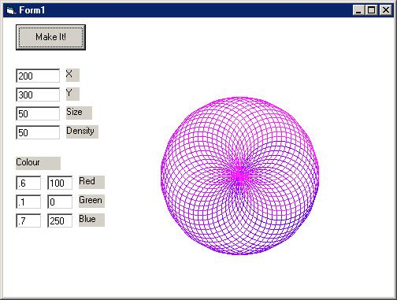



## Cool Circles

### Description

It makes a pile of circles, and it look pretty cool. See screen shot. (Please give rating or feedback)
 
### More Info
 
X, y, size, density, colour

a thinbg of circles

             |
---                |---
**Submitted On**   |2001-09-06 16:26:46
**By**             |[Michael Thomas](https://github.com/Planet-Source-Code/PSCIndex/blob/master/ByAuthor/michael-thomas.md)
**Level**          |Intermediate
**User Rating**    |5.0 (10 globes from 2 users)
**Compatibility**  |VB 6\.0
**Category**       |[Graphics](https://github.com/Planet-Source-Code/PSCIndex/blob/master/ByCategory/graphics__1-46.md)
**World**          |[Visual Basic](https://github.com/Planet-Source-Code/PSCIndex/blob/master/ByWorld/visual-basic.md)
**Archive File**   |[Cool Circl25999962001\.zip](https://github.com/Planet-Source-Code/michael-thomas-cool-circles__1-27017/archive/master.zip)

